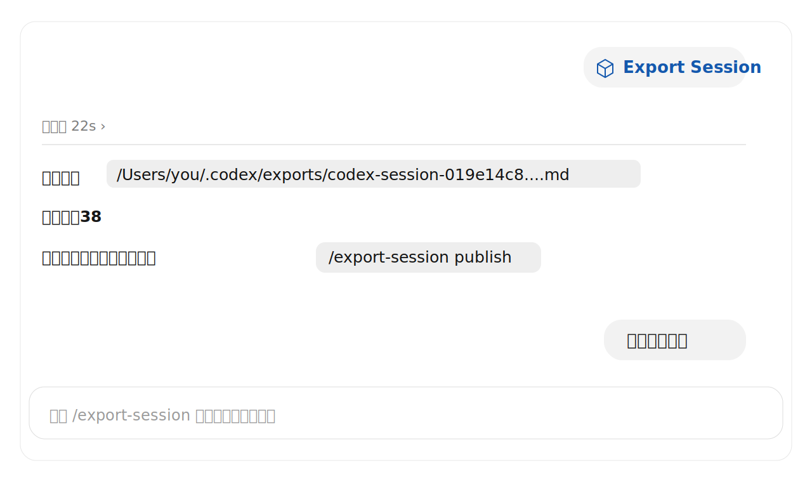
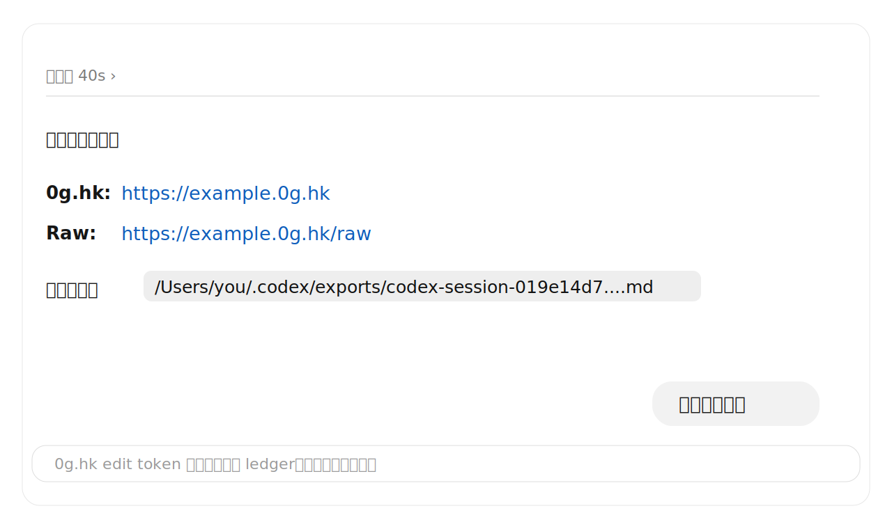

# codex-transcript-md

Export the current Codex conversation from inside chat.

This repo ships an agent skill named `export-session`. Install it once, then ask your agent to export the current session as a clean Markdown transcript. It reads Codex rollout JSONL files directly; it does **not** use cxs, what7, or any secondary index.

## Install the skill

```bash
npx skills add catoncat/codex-transcript-md
```

Restart your agent session after installing so the skill list refreshes.

## Use it in chat

```text
/export-session
```

The agent exports the current Codex session to the default local exports folder and reports the path plus message count.



Need a temporary public link? Ask naturally, or use:

```text
/export-session publish
```

The agent exports locally, publishes the Markdown to 0g.hk, opens/returns the public link, and keeps the edit token only in the local 0g.hk ledger.



## What gets exported

Only user-visible conversation events:

- `event_msg:user_message`
- `event_msg:agent_message`

Skipped by default: system/developer instructions, model context, reasoning, tool calls, tool outputs, token counters, and other internal runtime events.

## Where files go

If no output path is provided:

```text
~/.codex/exports/codex-session-<session-id>.md
# Windows: %USERPROFILE%\.codex\exports\codex-session-<session-id>.md
```

Codex sessions are read from:

```text
~/.codex/sessions
# Windows: %USERPROFILE%\.codex\sessions
```

0g.hk edit tokens are stored locally and never printed in chat:

- macOS/Linux: `${XDG_DATA_HOME:-~/.local/share}/0g-hk/links.jsonl`
- Windows: `%LOCALAPPDATA%\0g-hk\links.jsonl` (fallback: `%APPDATA%`, then `%USERPROFILE%\AppData\Local`)

## CLI escape hatch

The skill calls the CLI through `npx -y @act0r/codex-transcript-md`. You usually do not need to run it directly, but it is available:

```bash
npx @act0r/codex-transcript-md --current
npx @act0r/codex-transcript-md --current --publish-0g
npx @act0r/codex-transcript-md <session-id-or-jsonl-path> -o session.md
```

Options:

```text
Usage: codex-transcript-md <session-id-or-jsonl-path> [options]
       codex-transcript-md --current [options]

Options:
  -o, --out <file>           write Markdown to this path
  --stdout                   print Markdown to stdout
  --current                  export the newest local Codex rollout JSONL
  --publish-0g               publish the Markdown to 0g.hk after exporting
  --0g-name <name>           optional 0g.hk semantic short name
  --0g-ttl <ttl>             0g.hk TTL: 1h, 1d, or 7d (default: 7d)
  --codex-home <dir>         Codex home directory (default: ~/.codex)
  --session-root <dir>       session root to search (default: <codex-home>/sessions)
  --exports-dir <dir>        default output directory (default: <codex-home>/exports)
  -h, --help                 show help
  -v, --version              show version
```

## Programmatic API

```js
import { exportSessionToMarkdown } from "@act0r/codex-transcript-md";

const result = await exportSessionToMarkdown({
  current: true,
  outFile: "session.md",
});

console.log(result.messageCount, result.outputPath);
```
